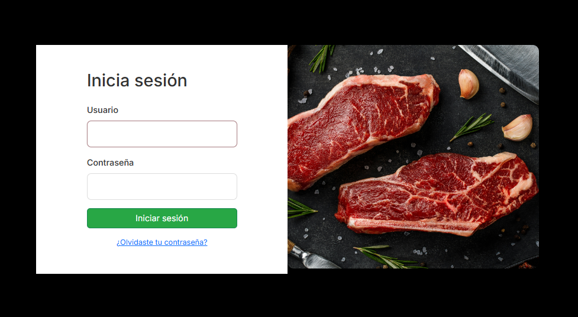
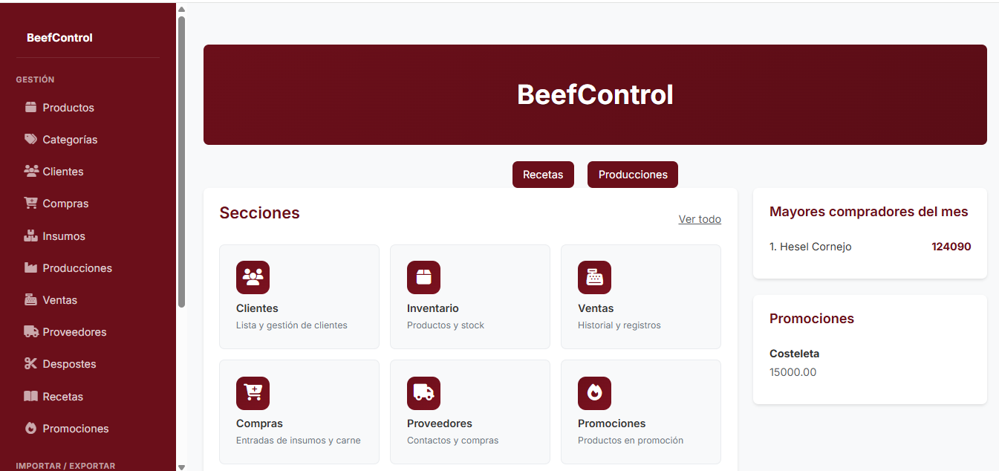
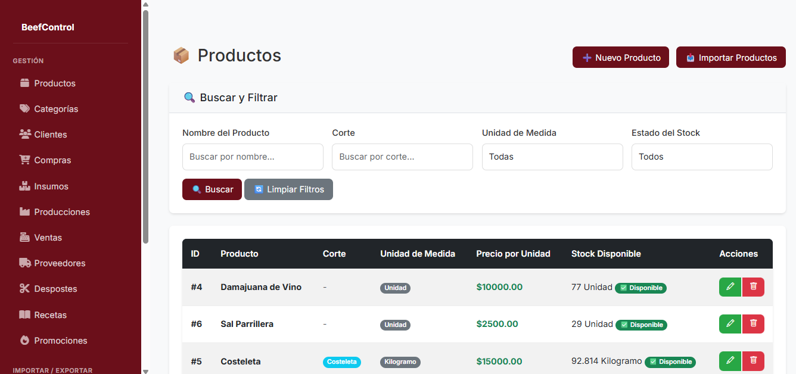
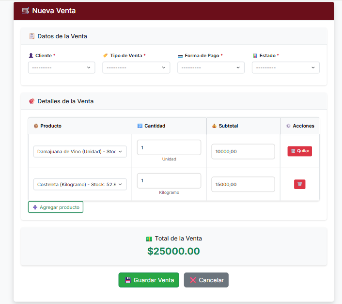

# 🥩 Sistema de Gestión - La Chanchería

Aplicación web desarrollada con **Django** para la gestión integral de una carnicería.  
Permite administrar productos, stock, ventas y compras, incorporando además procesos específicos del rubro como desposte, producción y gestión de recetas.

---

## 🚀 Funcionalidades

- 🔐 Sistema de autenticación (login)
- 📦 Gestión de productos (CRUD completo)
- 📊 Control de stock
- 💰 Registro de ventas
- 🛒 Registro de compras

### 🔥 Funcionalidades destacadas 

- 🥩 Gestión de desposte (transformación de cortes)
- ⚙️ Control de producción
- 📖 Sistema de recetas para elaboración de productos
- 🔄 Relación entre materias primas y productos finales

---

## 🛠️ Tecnologías utilizadas

- Python  
- Django  
- SQLite  
- HTML  
- CSS  

---

## 📸 Capturas del sistema

### 🔐 Login


### 📊 Dashboard


### 📦 Gestión de productos


### 💰 Ventas


### 🧾 Formulario de ventas


### 🛒 Compras


### 🧾 Formulario de compras


---

## ⚙️ Instalación y uso

1. Clonar el repositorio:

```bash
git clone https://github.com/lucasm0207/Lachancheria.git
Acceder al proyecto:
cd la-chancheria
Crear entorno virtual:
python -m venv venv
Activar entorno:
Windows:
venv\Scripts\activate
Linux/Mac:
source venv/bin/activate
Instalar dependencias:
pip install -r requirements.txt
Aplicar migraciones:
python manage.py migrate
Ejecutar servidor:
python manage.py runserver

## 🔐 Acceso al sistema

Para poder ingresar al sistema es necesario crear un usuario administrador.

Ejecutar el siguiente comando:

```bash
python manage.py createsuperuser

Completar los datos solicitados (usuario, email y contraseña).

Luego iniciar sesión desde:
http://127.0.0.1:8000/

También se puede acceder al panel de administración de Django en:
http://127.0.0.1:8000/admin/

📌 Notas
La base de datos no está incluida por motivos de seguridad.
El sistema se genera automáticamente al ejecutar las migraciones.
👨‍💻 Autor

Desarrollado por Lucas Molina